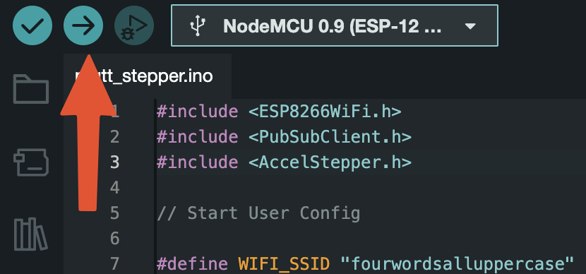

# README

# Open MQTT Blinds

An Arduino/ESP-based project to facilitate the automation of tilt wand blinds via MQTT


# Who is this for?

Anyone with a beginner’s level of mechatronics experience who wishes to automate their tilt wand blinds. 

](images/Untitled.png)

[https://www.blindschalet.com/bpa-423-industry-changes-stock-blinds-shades-december-2018.html](https://www.blindschalet.com/bpa-423-industry-changes-stock-blinds-shades-december-2018.html)

# Prerequisites

## Hardware

- Required:
    - [ESP8226 Board](https://smile.amazon.com/dp/B010N1SPRK?psc=1)
    - [28BYJ-48 Stepper Motor + ULN2003 Driver Combo](https://smile.amazon.com/dp/B01IP7IOGQ?psc=1)
    - [Buck Converter](https://www.amazon.com/LM2596-Converter-4-0-40V-1-25-37V-Voltmeter（2pcs）/dp/B085WC5G8N/ref=sr_1_3?crid=3Q47218J1UTVY&keywords=buck+converter&qid=1670349659&sprefix=buck+converter%2Caps%2C83&sr=8-3)
    - [Female-to-Female Jumper Wires](https://www.amazon.com/GenBasic-Piece-Female-Jumper-Wires/dp/B077N58HFK/?sprefix=female+to+female+dup,aps,110)
    - [12V DC power supply](https://www.amazon.com/100-240V-Transformers-Switching-Applications-Connectors/dp/B077PW5JC3/?crid=3CSDB8YVJ3ZJI&sprefix=12v+dc+power,aps,108)
        - There is a good chance you have one of these lying around. Be sure the output is listed as 12v 3A.
    - [DC Barrel Jack to 2 Pin](https://www.amazon.com/dp/B07LFRDSB7?psc=1&ref=ppx_yo2ov_dt_b_product_details)
        - (if you didn’t purchase the above)
    - Metric screws:
        - (4) M2x8
        - (2) M2x4
        - (2) M3x4
- Nice to haves:
    - Access to a 3D printer OR the ability to get 3D printed parts
    - [Wire strippers](https://www.amazon.com/IRWIN-VISE-GRIP-2078300-Self-Adjusting-Stripper/dp/B000OQ21CA)
    - [Dupont connector kit to create your own length wires](https://www.amazon.com/IWISS-1550PCS-Connector-Headers-Balancer/dp/B08X6C7PZM/?sprefix=dupon,aps,102)
    - [Connector crimper for the above](https://www.amazon.com/dp/B017JU20Z6/ref=sspa_dk_detail_2?psc=1&pd_rd_i=B017JU20Z6&content-id=amzn1.sym.4d0fffec-3aba-4480-8fad-c6bd8f7f6b41&s=hi&sp_csd=d2lkZ2V0TmFtZT1zcF9kZXRhaWxfdGhlbWF0aWM&spLa=ZW5jcnlwdGVkUXVhbGlmaWVyPUEyVzVJUU1US0RHREhXJmVuY3J5cHRlZElkPUExMDEyNDI0M1JOUzdHTkdEUFVQUSZlbmNyeXB0ZWRBZElkPUEwNjkyMjkzMUFUWU9CSVQzOEFTVCZ3aWRnZXROYW1lPXNwX2RldGFpbF90aGVtYXRpYyZhY3Rpb249Y2xpY2tSZWRpcmVjdCZkb05vdExvZ0NsaWNrPXRydWU%3D)
    - [Ferrule crimping set so you don’t have to connect bare wires to pins](https://www.amazon.com/gp/product/B073TZ5BBG/ref=ppx_yo_dt_b_search_asin_title?ie=UTF8&psc=1)

## Software

- [Arduino IDE](https://www.arduino.cc/en/software)
- [Home Assistant](https://www.home-assistant.io) (HA)
    - I won’t go through specific installation steps here as it can be installed on a wide array of platforms
    - This project does necessitate the use of Add-Ons which means an OS or Supervised installation is required
        
        ](images/Untitled%201.png)
        
        [https://www.home-assistant.io/installation/](https://www.home-assistant.io/installation/)
        
    - I am running HA as a Linux VM
    - HA Installation documentation can be found [here](https://www.home-assistant.io/installation)
    - I found this [YouTube video](https://youtu.be/sVqyDtEjudk) to be very helpful when setting up HA
- [HA - MQTT Broker](https://www.home-assistant.io/integrations/mqtt/)
    - I will go through installation in the setup section

# Setup

## Home Assistant - MQTT Broker

1. It assumed at this point that you have Home Assistant installed and you are able to access the GUI via local IP address 
2. Navigate to *****Settings → Add-Ons → Add-Ons Store***** and look for **Mosquitto broker**
    
    
    
    
    
3. Click install and check the *Watchdog* option
    
    
    
4. Create a MQTT user
    1. It’s considered best practice to create another user account for MQTT as it does not need admin access
    2. Navigate to ***Settings → People*** and click Add Person
        
        
        
    3. Hit the *******Allow person to login******* toggle and create a MQTT user. I name mined `mqtt-user`. 
        
        
        
        
        
    4. Be sure to save these credentials in your password manager for later. 
5. Restart your Home Assistant instance via ***Settings → System*** and click Restart. 
    
    
    
6. After restarting, you should see MQTT added to your Integrations Tab under ****Settings → Devices & Services**** 
    
    
    
7. Click Configure and Submit followed by Configure once again to enter the integration
    
    
    
    
    
8. Click Re-Configure and add your MQTT user credentials from before
    
    
    
9. From this page you can send payloads via MQTT as well as monitor topics. This can be helpful later on for debugging any issues. 
    
    
    

## Arduino IDE

1. Install Arduino IDE onto your platform of choice 
2. Add ESP8226 to board manager
    1. Navigate to preferences and paste `https://arduino.esp8266.com/stable/package_esp8266com_index.json` into ********Additional Board Manager URLs********
        
        
        
    2. Select ****NodeMCU 0.9**** as your board and hit OK. If you have connected your board via USB you can also select the port containing the board and hit OK. 
        
        
        
    3. If you prompted with this pop-up, click Yes
        
        
        
3. Import `mqtt_stepper.ino`
    1. Open `mqtt_stepper.ino` in Arduino IDE
    2. The required packages defined at the top of file should be automatically installed 
        1. If not, you will have to install them manually via the Library Manager
            
            
            
4. Fill out the user configuration section
    1. `USER_MQTT_URL` will be your Home Assistant GUI URL
    2. `USER_MQTT_USERNAME` and `USER_MQTT_PASSWORD` are the credentials you saved when creating a MQTT user
    3. `STEPS_PER_REV` should be set to `2048` if using a 28BY J-45 Stepper motor. If using another, see relevant technical information for correct number of steps
    4. `REVS_TO_CLOSE` will vary by blinds model. You can set this to `1` during the initial setup and tune it as necessary. 
    5. All other definitions can be left as written. 
    
    ```cpp
    // START USER CONFIG
    
    #define WIFI_SSID "your_wifi_name"
    #define WIFI_PASS "your_wifi_password"
    #define USER_MQTT_URL "xxx.xxx.xxx.xxx"
    #define USER_MQTT_PORT 1883
    #define USER_MQTT_USERNAME "your_mqtt_username"
    #define USER_MQTT_PASSWORD "your_mqtt_password"
    
    #define STEPPER_IN1 D5
    #define STEPPER_IN2 D6
    #define STEPPER_IN3 D7
    #define STEPPER_IN4 D8
    
    #define MSG_BUFFER_SIZE (50)
    
    #define STEPS_PER_REV 2048
    #define REVS_TO_CLOSE 8
    
    // END USER CONFIG
    ```
    
5. Connect the ESP8226 board via micro-USB if not already connected 
6. Click Upload and Arduino IDE will compile and send the sketch to the ESP8226 Board
    1. You should see it’s status in the output monitor 
    
    
    
    
    
7. Click the Serial Monitor button in the top right of screen and set the baud rate to `115200` 
    1. You should see connection status of board being outputted
    
    
    
    
    
8. You can verify that it can receive MQTT payloads by sending one via the MQTT integration in Home Assistant
    
    
    
    
    

## Assembly

1. Download and print `controller_box.3mf` and `adapter.3mf`
    1. The controller box was designed to use as few supports as possible so material choice should not matter
    2. My parts were printed in Overture Matte White PLA at 210C
2. Place each board onto their respective stand-offs and screw on to secure boards in-place
    1. I found it easier to first screw each board down before assembling the box sides
        
        
        
        NOTE: the ESP8226 board will be flipped when actually installed, with its pins facing away from the wall. Refer to wiring schematic for correct wire connections. 
        
        
        
        
        
3. Wire up the components according the following schematic:
    1. Ensure that the buck convert is set to output 5V before connecting it any other components 
        
        
        
4. Once all connections have been made, plugging in power should result in the board and buck converter LEDs turning on
    
    
    
    
    
5. At this point, you can either continue with assembly of controller box or move onto Home Assistant configuration to validate it works final assembly
6. Finish box assembly by sliding each of the side walls into the grooves on either side of case
    1. There will be some resistance but take care not to use too much force to avoid breaking the case or electronics
        
        
        
    2. Place the stepper motor into its slot and secure with (2) M3x4 screws
        
        
        
    3. Top with lid and controller box assembly is complete 
        
        
        
        Prototype shown missing a screw
        
7. Assemble the wand adapter
    1. Use a small screw driver or similarly shaped tool to depress the plastic notch securing the wand’s end cap 
        
        
        
    2. Line up the adapter hole with the wand hole and secure with one M2x8 screw
8. Mounting the box
    1. Using your choice of double sided adhesive, mount the box under the wand taking care to keep the angle as roughly parallel to maximize torque
        
        
        
        
        
    2. 

 

## Home Assistant - Adoption

1. Return to the Home Assistant WebUI and navigate to Add-Ons Store once again to install Studio Code Server
    
    
    
2. Open the Studio Code Server Web UI
    1. Once it has finished its first-time setup, use the Explorer to open `configuration.yaml`
        
        
        
    2. Add the following code to the end of the line:
    
    ```yaml
    mqtt:
      sensor:
        - unique_id: "blinds01_state"
          name: "Blinds01 State"
          state_topic: "blinds_node/position"
      switch:
        - unique_id: "blinds01_switch"
          name: "Blinds01 Switch"
          state_topic: "blinds_node/position"
          command_topic: "blinds_node/input"
          payload_on: "0"
          payload_off: "1"
          state_on: "OPENED"
          state_off: "CLOSED"
          qos: 1
          retain: true
    ```
    
3. Restart your Home Assistant instance via *Settings* → *System* and click Restart.
4. You should now see 2 new entities added to your Home Assistant Dashboard
    
    
    
5. You should now able to send MQTT payloads via this switch to blinds controller 
    1. You can use MQTT integration to monitor payloads being sent 
        
        
        

## Adding it HomeKit

1. Install HomeKit Bridge integration following these [instructions](https://www.home-assistant.io/integrations/homekit#setup)
    1. Return to the integrations tab and hit Add Integration
    2. Search for Apple → HomeKit
    
    	
    
    	
    
2. Once the integration has been installed, select *HomeKit Mode* to `bridge` and *Inclusion Mode* to `include` 
    1. At a minimum include the Domains: `Switch` 
        
        
        
3. Search and select the new *Blinds01* entity
    
    
    
4. You should now see a new accessory added to your HomeKit
    
	
